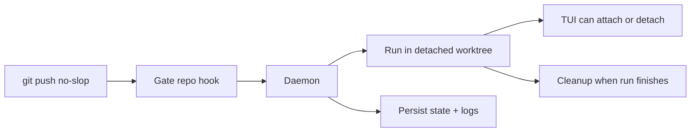

The daemon is a long-running background process that manages pipeline runs. The
installer prefers setting it up as a managed background service, and
`no-slop`, `init`, `attach`, and `rerun` keep that service
installed and running for you when that path is available.

## Why a daemon exists

The daemon exists so `git push no-slop` stays fast and the gate can keep
working after your shell command returns.

- Git hands the push to the local gate repo.
- The hook notifies the daemon and exits immediately.
- The daemon owns the long-running work: worktrees, pipeline execution, TUI
  events, state, cleanup, and crash recovery.



On macOS this is a per-user `launchd` agent, on Linux a per-user `systemd` service, and on Windows a Task Scheduler task. The installed artifact names are scoped by `NS_HOME` with a short stable suffix, so the paths and service identifiers look like `~/Library/LaunchAgents/com.kunchenguid.no-slop.daemon.<suffix>.plist`, `~/.config/systemd/user/no-slop-daemon-<suffix>.service`, and the Windows task `no-slop-daemon-<suffix>`. That keeps multiple `no-slop` installs from colliding when they use different `NS_HOME` roots. Those service managers keep the daemon available across CLI invocations and restart it on demand after you replace the binary. A managed service starts with a minimal environment, so at daemon startup it resolves `PATH` and proxy variables from your login shell and the baked-in service definition; [Environment the daemon sees](/no-slop/reference/environment/#environment-the-daemon-sees) owns that resolution story. Restart the daemon after changing those values. If managed service install or startup is unavailable or fails, `no-slop` falls back to starting a detached daemon process instead.

## Starting and stopping

Most people do not need to manage the daemon directly. The usual commands
already make sure it exists when needed.

```sh
# Explicit management
no-slop daemon start
no-slop daemon stop
no-slop daemon restart
no-slop daemon status

# Ensures the daemon is running, using the managed service when possible
no-slop
no-slop init
no-slop attach
no-slop rerun
no-slop axi run
no-slop axi respond
```

`no-slop update` never resets the daemon in this build, because self-update is disabled and the binary is never replaced. After rebuilding from source, run `no-slop daemon restart` yourself; the [CLI reference](/no-slop/reference/cli/#no-slop-update) owns why the command is disabled.

`no-slop daemon stop` and `no-slop daemon restart` guard against active work in two tiers. If pending or running pipeline runs exist, each refuses by default and prints every active run's ID, status, branch, short head SHA, and what the daemon is doing with it: `executing` a step, `parked` at a gate awaiting the driving agent, or `idle`. Each takes its own `--force` to proceed past parked and idle runs, both of which survive a stop, because crash recovery resumes a parked gate and an idle row was never in flight.

`--force` deliberately does not cover a run that is executing a step. Stopping the daemon cancels the step, fails the run, and leaves its pipeline commits stranded in the local gate repo, so forcing past it destroys work that no restart brings back. Each command takes a separate `--abandon-executing-runs` for that case, which implies `--force`. Prefer waiting for the step to finish or park at a gate, or ending the run explicitly with `no-slop axi abort --run <id>`, which takes it terminal cleanly instead of failing it mid-step.

A run counts as executing whenever a daemon is serving this `NS_HOME` and the run is not positively parked, which includes the moment between two steps and a `pending` run the daemon is still setting up. When no daemon is serving it, nothing can be mid-step and every remaining active row counts as idle. For `daemon stop` and `daemon restart`, a daemon that simply cannot be reached still counts as serving, because being unreachable is not evidence of being down. The exception is positive proof of death - the recorded process is gone and nothing is still serving this root - which is exactly what an unclean death leaves behind, so the rows a crashed daemon stranded are classified as idle and `--force` clears them without `--abandon-executing-runs`.

`no-slop daemon start` applies the executing tier of the same guard, because when the daemon is already running it refreshes a stale service definition by stopping and restarting it. It has no `--force`, since starting the daemon is how you recover from a stopped one and parked or idle runs never stand in the way; only an executing run refuses it, and only `--abandon-executing-runs` proceeds past that.

Those overrides are available only to an ordinary top-level caller. A
process descended from an active validation-step agent cannot start, stop,
restart, or update the daemon; recursive containment refuses the command before
any lifecycle mutation, with no `--force`, `--abandon-executing-runs`, or
`--yes` bypass.
Every invocation of `daemon start`, `daemon stop`, `daemon restart`, or `update` - forced or not - logs the caller's PID, parent PID, and parent command line to `~/.no-mistakes/logs/cli.log`, recording `--force` and `--abandon-executing-runs` as separate fields, so a later incident can identify which agent or process triggered it and what it authorized.

The daemon writes an identity record to `~/.no-mistakes/daemon.pid` and listens on a Unix socket at `~/.no-mistakes/socket`. On Windows, it uses a localhost TCP listener and a protected endpoint file at the same path. CLI clients bound how long they wait for that socket to accept a connection with `daemon_connect_timeout` (default `3s`, override with `NS_DAEMON_CONNECT_TIMEOUT`), so a daemon process that is alive but stuck fails the connection instead of hanging the caller; see [Troubleshooting](/no-slop/guides/troubleshooting/#check-for-stale-artifacts).
Commands that ensure the daemon is running (`no-slop`, `init`, `attach`, `rerun`, `axi run`, `axi respond`) also fail fast rather than silently starting a replacement daemon when the socket file exists but nothing answers at all, such as a dead socket left behind by an unclean exit; `no-slop daemon start` self-heals past that case.
After accepting a shutdown request, `daemon stop` waits for the daemon process itself to exit before returning success. Losing IPC health is not enough because the listener closes near the start of shutdown, while the singleton lock and other process-owned resources are released only at process exit. `daemon restart` uses the same complete-stop handoff before starting the replacement, so the old and new processes do not contend for the root.
A daemon that already died uncleanly is the one case that needs no waiting. When the recorded process is gone and nothing is still serving this root, `daemon stop` treats the root as already stopped: it removes the leftover PID file and socket and reports success, instead of waiting out the graceful-exit timeout for a process that will never exit or failing because a dead PID cannot be inspected. `daemon restart` therefore recovers from an unclean death on its own.

Process launch and daemon readiness are separate states. After taking the singleton lock, the daemon publishes its PID before exclusive crash recovery begins, but startup is not successful until the IPC server returns a real health response. `daemon start` allows up to 45 seconds for cold environment setup and recovery, reports a child that exits before readiness promptly, and never treats the PID file or a bound socket as proof that the daemon is ready. If detached startup times out, the command kills and reaps that child before returning; if managed startup fails, it cleans up the managed attempt before trying the detached fallback and preserves both errors when both paths fail.

Only one live daemon can own an `NS_HOME` at a time.
At startup - before crash recovery runs and before the socket is bound - the daemon takes an exclusive OS file lock on `~/.no-mistakes/daemon.lock` and holds it for the life of the process.
A second daemon started against the same root fails with "a no-slop daemon is already running for this NS_HOME" (with the holder's PID and start time when available) instead of stealing the first daemon's socket and running crash recovery against its live runs.
The OS releases the lock automatically when the owning process exits or crashes, even on SIGKILL, so unlike the PID file the lock can never go stale.
As an independent safety layer, the daemon also refuses to bind the Unix socket while something is still answering on it; only a provably stale socket file (nothing listening) is removed and rebound.

## What it does

When a push arrives via the post-receive hook:

1. Creates a detached worktree at `~/.no-mistakes/worktrees/<repoID>/<runID>/`
2. Starts the pipeline executor in that worktree
3. Streams events to any connected TUI clients and serves request/response state to AXI clients
4. Cleans up the worktree when the run finishes (success or failure)

Event delivery is bounded, so a slow or wedged client can never stall a run. Under pressure the daemon may drop ordinary log output, but it never silently loses a state change: it coalesces those into a single gap signal, and the TUI and `axi` respond by re-reading authoritative run state. A live view can therefore skip log lines while it is behind, but it converges on the run's real state. After a dropped connection, the TUI retries with a bounded delay and reconciles when it reattaches; if the daemon remains unavailable, it surfaces the connection error instead of retrying forever.

Pipeline agents are prompted to keep intentional writes inside that detached worktree and avoid changing system state outside it, such as Homebrew packages, apps under `/Applications`, or global tool configuration.
That reduces surprising machine-level side effects and macOS App Management prompts, but it is prompt steering rather than a true sandbox.
While executing steps, the daemon also owns child-process cleanup.
Configured commands and one-shot agent subprocesses are terminated as a process tree on completion, failure, or cancellation so leaked test workers, build watchers, or dev servers cannot accumulate across runs.
Each process is asked to exit first and only forcibly killed if it is still running a few seconds later.
A process can still escape that tree by detaching itself into its own session, so when a run finishes the daemon also terminates anything still standing in that run's worktree before removing the directory.
That sweep is scoped by working directory: it never touches a worktree whose run is still active, and it can never reach a process working outside `~/.no-mistakes/worktrees/`.

## Concurrent push handling

If you push to the same branch while a run is already active, the daemon:

1. Cancels the in-progress run (reason: "cancelled: superseded by new push")
2. Waits for it to finish
3. Starts a new run with the latest push

Pushes to different branches run concurrently.

This is another reason the daemon exists: branch-level coordination is easier to
reason about in one long-lived process than inside independent hook invocations.

## Crash recovery

On startup, the daemon checks for runs that were left in `pending` or `running` status (which means the daemon crashed while they were active):

- Completes legacy active rows whose persisted PR state is already `merged` or `closed`, including their CI step, before active-run recovery and parked-run planning
- Resumes only fully recorded parked approval gates whose worktree and step history can be validated; incomplete or ambiguous active runs fail closed
- Before resuming a parked CI gate, re-checks its persisted PR URL through the configured provider; a currently merged or closed PR completes the stale gate, while an open, unknown, or unreachable PR remains parked
- Marks every other stale active run as `failed` with the message "daemon crashed during execution"
- Reaps orphaned managed agent servers left behind by a crashed daemon or setup wizard
- Reaps orphaned step and agent process trees recorded by a crashed daemon, so leaked test workers or build watchers that escaped their process group cannot outlive the daemon that spawned them; this sweep is skipped entirely when another daemon is already alive
- Removes orphaned worktree directories via `git worktree remove --force` - but never one whose run is still `pending` or `running`; only leftovers from terminal runs or directories with no matching run record are removed
- Migrates gates named by authoritative repository records, plus legacy directories with the strict `<repoID>.git` shape. Before changing an unstamped candidate, it validates that the directory is a bare repository without relying on the current directory or ancestor Git discovery; unrelated and malformed directories are rejected without hook or Git mutation
- For a validated legacy gate, installs or refreshes the no-slop-managed pre-receive admission and post-receive notification hooks, preserving an existing custom pre-receive hook behind the admission wrapper, then enables push-option support and reapplies per-worktree hook-path isolation
- Records a content-versioned gate configuration stamp only after the whole migration succeeds. Normal restarts check current stamped gates from the filesystem without rerunning the mutating Git commands
- Clears any parked-awaiting-agent marker so a recovered failed run is not shown as still waiting for `axi respond`

## Logging

Daemon lifecycle logs go to `~/.no-mistakes/logs/daemon.log`. Startup logs report concise phase durations, gate migration counts, and a final `daemon ready` message only after IPC health succeeds. Successful read-only IPC requests such as health and run-state reads appear only at `debug`; mutations, stream starts, lifecycle transitions, and failed requests remain visible at `info` or `warn`.

Managed Rovo Dev and OpenCode server stdout and stderr go to `~/.no-mistakes/logs/managed-server.log`, separate from concise server startup, exit, and failure summaries in the lifecycle log. Output written before the lifecycle logger is ready, plus direct crash output, goes to `~/.no-mistakes/logs/daemon-bootstrap.log`. The lifecycle log retains a 32 MiB current file and three backups, managed-server output retains a 16 MiB current file and two backups, and bootstrap/crash output retains a 1 MiB current file and two backups. Backups use `.1` for the newest retained file.

The setup wizard separately captures managed agent-server output in `~/.no-mistakes/logs/wizard-agent.log`. Each pipeline step writes to `~/.no-mistakes/logs/<runID>/<step>.log`, and fatal step errors are appended there so the step log includes the failure reason even when the detail comes from command stderr. Daemon lifecycle and `update` invocations are logged separately to `~/.no-mistakes/logs/cli.log`; [Starting and stopping](#starting-and-stopping) owns what that line records.

Set the log level in global config:

```yaml
log_level: debug # debug | info | warn | error
```

## Shutdown

`no-slop daemon stop` stops the current daemon process without removing the managed service. The next `no-slop daemon start`, `no-slop`, `init`, `attach`, or `rerun` will start it again through the same service manager when available, or as a detached daemon otherwise.
The [starting and stopping](#starting-and-stopping) section owns the active-run
guard, the top-level `--force` override, and the separate validation-step
containment rule.

1. Cancels all active runs
2. Waits up to 30 seconds for goroutines to finish
3. Removes the PID file and socket
